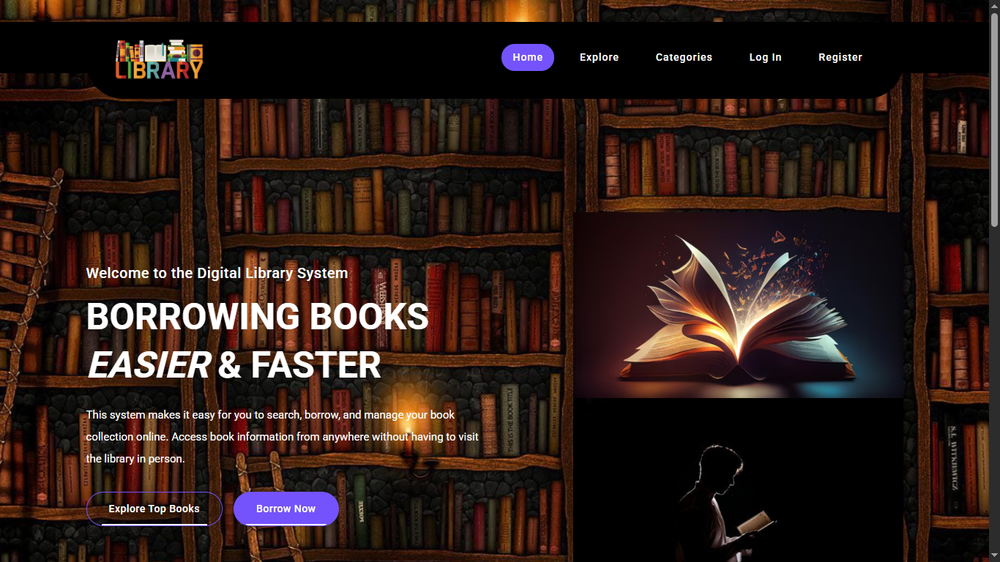
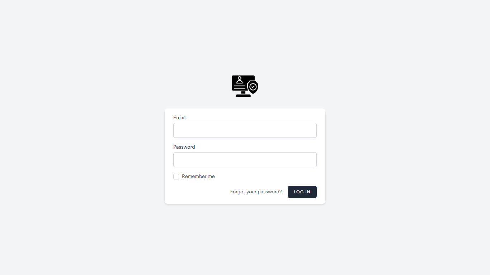
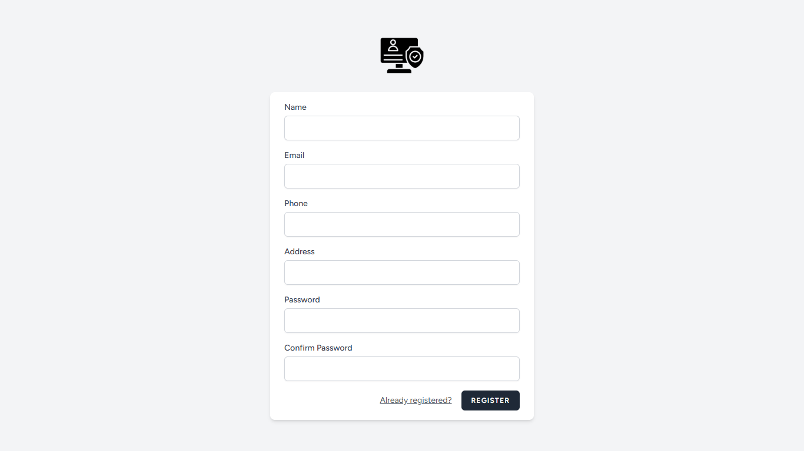
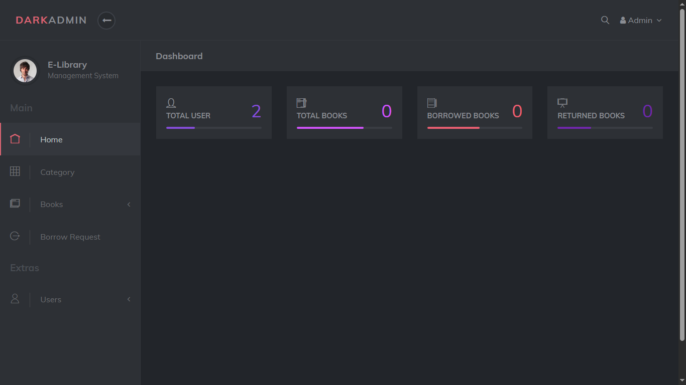

<p align="center">
  <a href="https://laravel.com" target="_blank">
    
  </a>
</p>

<h2 align="center">📚 Library Management System</h2>

<p align="center">
  
  
  
  
  
</p>

<p align="center">
  A web-based library management system built with <strong>Laravel 10</strong>, <strong>Jetstream</strong>, and <strong>Livewire</strong>.
  <br>
  <strong>Easily and securely manage book collections, borrowing transactions, categories, and user management.</strong>
</p>

---

## ✨ Features

✅ User Authentication & Management (Jetstream + Roles)  
✅ Book & Category CRUD Operations  
✅ Book Borrowing & Return System  
✅ Book Stock Validation & Notifications  
✅ Search & Category Filtering  
✅ Complete Admin Dashboard  
✅ Responsive & Modern UI  
✅ QR Code Book Identification  

---

## 🛠️ Technologies Used

| Technology | Version |
|------------|---------|
| Laravel | 10.x |
| PHP | 8.1+ |
| Livewire | Jetstream Stack |
| TailwindCSS | Jetstream Default |
| Bootstrap | (For Home UI) |
| MySQL/MariaDB | Latest |
| DOMPDF | Latest |
| Endroid/QRCode | Latest |

---

## ⚠️ Prerequisites

Make sure the following software is installed on your machine:

| Software | Download |
|----------|----------|
| PHP 8.1+ | https://www.php.net/downloads.php |
| Composer | https://getcomposer.org/download/ |
| Node.js & npm | https://nodejs.org/en/download/ |
| Git | https://git-scm.com/downloads |
| MySQL/MariaDB | Included with XAMPP/Laragon |

---

## 📚 Learning Resources

- [YouTube Playlist – Laravel Library Management System Project Tutorial](https://www.youtube.com/playlist?list=PLm8sgxwSZoffQAcAEHAlfyuWGs7U9ZJin)

> The main reference for this project comes from the YouTube tutorial series. Special thanks to the content creator for sharing their knowledge.

---

## 🚀 Installation & Setup

Follow the steps below in order.

### 1️⃣ Clone the Repository

Open your terminal (CMD, PowerShell, or Git Bash) and run:

```bash
git clone https://github.com/pangeran-droid/Library-System.git
cd Library-System
```

### 2️⃣ Install Laravel Dependencies (PHP)

```bash
composer install
```

> ⚠️ If Composer is not recognized, make sure it has been installed correctly.

### 3️⃣ Install Frontend Dependencies (Node.js)

Install the frontend dependencies and build the assets:

```bash
npm install
npm run build
```

> ⚠️ If npm is not recognized, make sure Node.js has been installed.

### 4️⃣ Copy the Environment File

```bash
cp .env.example .env
```

### 5️⃣ Generate the Application Key

```bash
php artisan key:generate
```

### 6️⃣ Configure the Database

Update your `.env` file:

```env
DB_DATABASE=library_system
DB_USERNAME=root
DB_PASSWORD=
```

### 7️⃣ Run Database Migration

```bash
php artisan migrate
php artisan db:seed
```

### 8️⃣ Start the Development Server

After everything is configured, start the Laravel development server:

```bash
php artisan serve
```

The application will be available at:

```
http://127.0.0.1:8000
```

Open the URL in your browser to access the application.

---

## 🔐 Default Login Credentials

### Admin Account

```text
Email: admin@gmail.com
Password: password
```

### User Account

```text
Email: user@gmail.com
Password: password
```

---

## 👁️ Preview

| Home | Login |
|------|-------|
|  |  |

| Register | Dashboard |
|-----------|-----------|
|  |  |

---

## 📄 License

This project is open-source and available under the MIT License.

See the **LICENSE** file for more details.

---

## 👥 Contributors

<!--
<p align="center">
  <a href="https://github.com/pangeran-droid/Library-System/graphs/contributors">
    
  </a>
</p>
-->

<p align="center">
  <a href="https://github.com/pangeran-droid">
    
  </a>
  <a href="https://github.com/DitaSupriyadi18">
    
  </a>
  <a href="https://github.com/Cahyo661">
    
  </a>
  <a href="https://github.com/mrifqizidan7">
    
  </a>
  <a href="https://github.com/iim028">
    
  </a>
  <a href="https://github.com/fathullohalfathir">
    
  </a>
  <a href="https://github.com/Adil8566">
    
  </a>
</p>
